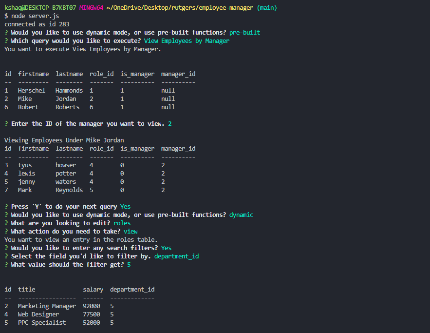

# employee-manager

## Description
    Dynamically execute SQL queries and actions using a command-line database management system.

## Usage
    Run node server.js from the command line, and follow the steps as directed by the program.

## Install 
    Clone the repository, and you're all set.

## Testing
    You can verify your recorded actions by accessing the database itself (recommend Workbench).

## Contributing
    Put in a pull request, or message me. I'd love to collaborate.

## Questions
   * Github: https://github.com/kshaq777
   * Email: [kshaq777@gmail.com](mailto:kshaq777@gmail.com)
